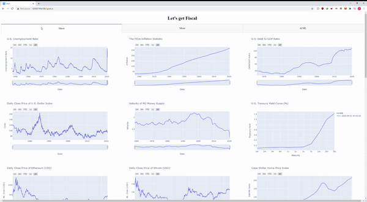
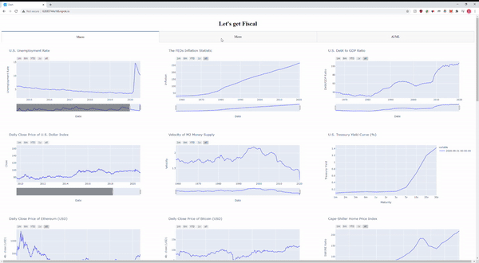

# Financial Dashboard
Analysts meander the web trying to find quality, real-time data to assist in their decision making processes.  It's time consuming and effortful.  You could pay $20,000 for a Bloomberg terminal or you could create your own, and that's what we did!

We created a dashboard which displays an overview of various financial instruments and data.  
- The Macro tab displays charts on Debt/GDP ratio, Dow/Gold ratio, Gold/Silver ratio, Real estate/Gold, Gold/Monetary base, S&P/Real estate, ISM manufacturing index, Unemployment, Commodities, CPI, Retail Sales, Velocity, Yield curve, Dollar index (DXY), Cryptocurrencies, Global bond yields, exchange rates and commodity prices.  
- The Micro tab tab provides company information, financial ratios, and other key metrics for the equity specified by the user. 
- The ML/AI tab returns company stock price information and predicts volatility and stock price movement.

## Requirements
See requirements.txt file.

## Deployment
All visualizations were built with Plotly and deployed with Dash. Ngrok was used to connect the localhost server to a public URL. Ngrok creates a public URL from the dash local server.

## Built With

* [FredAPI](https://github.com/mortada/fredapi)
* [Alpha Vantage API](https://www.alphavantage.co/documentation/)
* [Yahoo Finance API](https://pypi.org/project/yfinance/)
* [Financial Modeling Prep API](https://financialmodelingprep.com/developer/docs/)
* [Tensorflow](https://www.tensorflow.org/)
* [Scikit Learn](https://scikit-learn.org/stable/)
* [Dash](https://plotly.com/dash/)
* [Beautiful Soup](https://www.crummy.com/software/BeautifulSoup/bs4/doc/)
* [Plotly](https://plotly.com/python) - Primary visualization library
* [ngrok](https://ngrok.com/)

## Usage
### Macro Tab

### Micro Tab

Notes for Micro Tab
- Please enter only 1 ticker every 60 seconds. Due to API call limits it only allows for 1 ticker every minute.
- Only the first 5 charts will be updated

### AI/ML Tab

Notes for the AI ML TAB
- SPY, DJIA, NSAQ are fixed graphs with rolling 30 day pct changes. These graphs will not change given the ticker symbol, only the bottom 2 graphs change.
- Every time you enter a new ticker please allow a few seconds for the machine learning model to run and update the corresponding Forecast Plot

### FAQ
- For full sized videos checkout the Videos directory.
